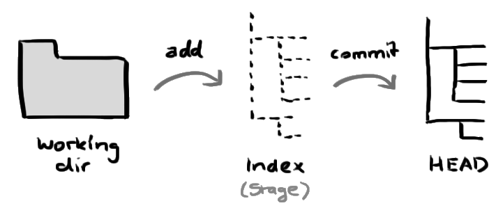
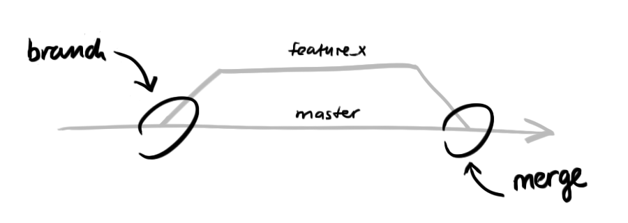

# Prácticas con GIT

1) git init
2) git add *
3) git commit -m "Commit message"
4) git push origin main
5) git checkout -b feature_x
6) git push origin feature_x

## Cambios agregados por alumnos

HOLAAhola como estas
Buenas ☻
Hola somos Nico, Eve y Mariano
Wachin.!
+ Nuevo contenido
+ nuevo contebido
Hola mundo!

Hola soy Paula
+Agustina Prieto
 
## Trees

## Ramas

